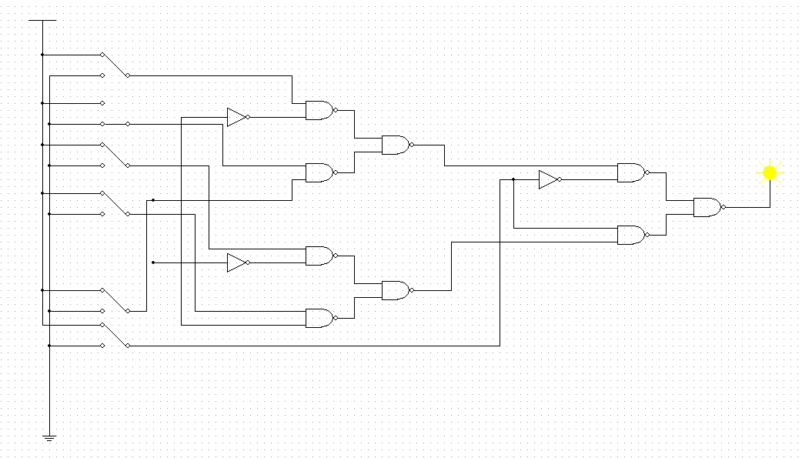

<div align="center">
  
# Designing and Simulating of Digital Multiplexer (4-to-1)
</div>

This project focuses on the design, simulation, and implementation of a 4-to-1 digital multiplexer using 2-to-1 inverting multiplexers constructed from PMOS and NMOS transistors. A multiplexer (MUX) is a fundamental combinational logic circuit commonly used in digital systems to select one of several input signals and route it to a single output line based on control inputs. Understanding and building multiplexers is essential for developing more complex digital systems such as processors, communication devices, and embedded controllers.

To achieve a complete understanding of the multiplexer’s behavior, we designed the transistor-level circuit using Multisim software. This allowed us to visualize and simulate the behavior of the system at the CMOS transistor level, gaining insight into how logical operations are physically realized in hardware. After verifying the transistor-level design, we transitioned to implementing the system using VHDL (VHSIC Hardware Description Language) and tested it on the DE2-115 FPGA development board. This part of the project focused on writing structured VHDL code, creating testbenches for simulation, and finally uploading the design to the board for real-world verification using switches, LEDs, and seven-segment displays.

The project followed a hierarchical design methodology. First, we designed 2-to-1 inverting multiplexers, and then we combined them to build the full 4-to-1 multiplexer system. Throughout the project, special attention was paid to both the logic behavior and the hardware efficiency of the design. Simulation waveforms were analyzed to validate functionality across all input combinations, ensuring the design met the intended logic before hardware testing. Overall, this project provided valuable hands-on experience in transistor-level CMOS design, digital logic synthesis using VHDL, simulation analysis, and FPGA-based circuit implementation, strengthening both theoretical knowledge and practical skills essential for digital systems engineering.

<details>
<summary>PMOS, NMOS, and CMOS Transistors: Working Principles</summary>
<br>
	
---
In modern digital electronics, transistors play a vital role as the fundamental building blocks of all logic circuits. Among the different types of transistors, the MOSFET (Metal-Oxide-Semiconductor Field-Effect Transistor) is the most widely used due to its high switching speed and low power consumption. MOSFETs come in two main types: NMOS (N-type MOSFET) and PMOS (P-type MOSFET), each having distinct characteristics and operating principles.

- **NMOS (N-type MOSFET)**: In an NMOS transistor, electrons are the majority carriers, making it faster in switching operations. The transistor is turned on (conducting state) when a high voltage (logic 1) is applied to the gate terminal relative to the source. In this state, a conductive channel forms between the drain and the source, allowing current to flow easily. When the gate voltage is low (logic 0), the NMOS transistor is in the off state, and current does not flow.

- **PMOS (P-type MOSFET)**: In contrast, a PMOS transistor operates with holes as the majority carriers. A PMOS transistor is turned on when a low voltage (logic 0) is applied to the gate terminal relative to the source, creating a conductive channel. When a high voltage (logic 1) is applied to the gate, the PMOS device switches off. PMOS transistors typically have slower mobility compared to NMOS, leading to slower switching speeds, but they offer benefits like lower leakage currents.

- **CMOS (Complementary MOS)**: CMOS technology integrates both NMOS and PMOS transistors to build efficient logic gates. In a CMOS circuit, when one transistor (either PMOS or NMOS) is on, the other is off. This complementary behavior results in very low static power consumption because current only flows during switching transitions, not in a steady state.

The use of CMOS technology enables the development of dense, power-efficient, and highly reliable digital circuits. CMOS forms the backbone of modern microprocessors, memory chips, and virtually all integrated circuits used today.

<div align="center">
  
</div>
<br>

Understanding how PMOS and NMOS transistors behave individually and together in CMOS is critical to designing complex circuits like multiplexers at the transistor level.

---
</details>

<details>
<summary>Multiplexer (MUX): Definition and Function</summary>
<br>
	
---
A multiplexer (MUX) is a fundamental combinational logic device that selects one of several input signals and forwards the selected input to a single output line. It functions as a digital data selector, making it possible for multiple input signals to share a single communication line or resource. The selection process is controlled by selection inputs (also called control lines), and the number of these selection lines depends on the number of inputs. In general, an N-to-1 multiplexer requires log(N) selection lines. For example, a 2-to-1 multiplexer requires one select line, a 4-to-1 multiplexer requires two select lines, and an 8-to-1 multiplexer requires three select lines.

In a 4-to-1 multiplexer specifically, there are four data inputs (usually labeled D0, D1, D2, and D3), two select lines (S1 and S0), and one output (Y). The select lines determine which data input is connected to the output. The functionality can be described as follows: when the select lines are set to (S1, S0) = (0, 0), the output Y will follow input D0. If the select lines are (0, 1), the output will be D1; if they are (1, 0), the output will be D2; and if they are (1, 1), the output will be D3. This mechanism allows a single output line to dynamically switch between multiple inputs based on control signals.

<div align="center">
  
</div>
<br>

Multiplexers are essential components in digital systems and have wide applications in areas such as data routing, communication systems, arithmetic operations, and control unit design. They help to simplify circuit design by reducing the number of required components. Instead of having separate wiring for each input, a multiplexer enables efficient use of hardware resources by controlling multiple inputs through a smaller number of control lines. Their ability to selectively manage data paths makes them critical in optimizing system performance and circuit scalability in modern electronics.

---
</details>

<details>
<summary>Justification for Using 2-to-1 Inverting MUX for Designing a 4-to-1 MUX</summary>
<br>
	
---
Designing a 4-to-1 multiplexer directly at the transistor level can quickly become complex and inefficient, especially when working with PMOS and NMOS devices. To address this, a more organized and modular approach is to first design a 2-to-1 inverting multiplexer and then use these building blocks to construct the 4-to-1 MUX. This method not only simplifies the design process but also improves the clarity and manageability of the circuit during analysis and simulation. 

The main reasons for choosing a 2-to-1 inverting MUX as the base unit include:

- **Simplicity in Design**: A 2-to-1 inverting MUX is straightforward to implement using a small number of transistors, making it easier to draw, simulate, and debug.

- **Reduction of Transistor Count**: By reusing a simple 2-to-1 block multiple times, the overall transistor count remains optimized, which is critical for minimizing chip area and power consumption.

- **Ease of Analysis**: It is much easier to analyze the behavior of a small, predictable building block than to handle a large, complex circuit all at once.

- **Hierarchy and Scalability**: Using smaller modules allows for a hierarchical design structure, where multiple 2-to-1 MUXes are combined logically to form larger multiplexers, enhancing scalability and reusability.

By first constructing 2-to-1 inverting MUXes and then connecting them appropriately, the final 4-to-1 multiplexer can be realized efficiently with minimal design overhead. Additionally, the inversion introduced by the inverting MUX can be systematically corrected either logically or at later stages in the circuit, offering flexibility in achieving the desired final output behavior.

<div align="center">
  
</div>
<br>

Further advantages of this modular design approach are:

- Simplified Simulation and Testing: Smaller modules are easier to test individually before being combined into the final design.
  
- Logical Organization: The clear division into blocks makes the overall circuit structure easier to understand and present.
  
- Better Performance Control: The designer can better control signal delays, loading effects, and switching behavior by analyzing each stage separately.

Thus, using a 2-to-1 inverting multiplexer structure provides both practical and theoretical advantages, ensuring a more successful and optimized implementation of the 4-to-1 multiplexer.

---
</details>

## Design of the 4-to-1 MUX

In digital systems, controlling the flow of data efficiently is crucial for proper operation and performance. One of the essential devices used to achieve this control is the multiplexer (MUX). A multiplexer selects one of several input signals and forwards it to a single output line, based on specific control inputs known as selection lines. In this section, we focus on the design and operation of a 4-to-1 multiplexer (4-to-1 MUX), which handles four input signals using two selection lines. We will discuss the concept of the 4-to-1 MUX, derive its logic expression, and present its corresponding truth table to provide a comprehensive understanding of its functionality and role in digital circuit design.

<details>
<summary>Concept of a 4-to-1 Multiplexer</summary>
<br>
	
---
A multiplexer (MUX) is a digital device that selects one input signal from several available input lines and forwards it to a single output line. It is essentially a data selector, which is useful for routing data in digital circuits. The 4-to-1 MUX specifically has four input lines, two selection lines, and one output line. The main purpose of this device is to choose one of the four inputs based on the values of the selection lines and then pass the chosen input to the output. 

The operation of the 4-to-1 multiplexer is simple but very powerful. It uses two selection lines, `S1 and S0`, to determine which of the four input lines `(D0, D1, D2, D3)` should be connected to the output Y. The selection lines act like a binary control signal that picks the appropriate input. By adjusting the values of S1 and S0, the MUX can be programmed to select any one of the four inputs. For example, if `S1 = 0 and S0 = 1`, the output will be connected to `D1`.

The versatility of the 4-to-1 MUX is vital in many applications, especially when it comes to controlling data flow or routing multiple signals through a single channel. It is often used in communication systems, data multiplexing, and digital circuits to manage the complexity of handling multiple signals without requiring multiple physical paths.

---
</details>

<details>
  <summary>Logic Expression Derivation for 4-to-1 MUX</summary>
  <br>
	
---	
To describe the behavior of the 4-to-1 MUX in a more formal way, we derive the logic expression for the output in terms of the selection lines and the input lines. This expression will dictate the behavior of the MUX based on the different combinations of S1 and S0. Since the MUX has four inputs, the logic expression is a combination of these inputs and the selection signals.

The logic expression for the 4-to-1 multiplexer is derived from the following truth table:

    Y = (¬S1 ⋅ ¬S0 ⋅ D0) + (¬S1 ⋅ S0 ⋅ D1) + (S1 ⋅ ¬S0 ⋅ D2) + (S1 ⋅ S0 ⋅ D3)

This equation shows how each of the inputs (D0, D1, D2, D3) is selected based on the values of S1 and S0:

- When S1 = 0 and S0 = 0, the output Y will be equal to D0.
- When S1 = 0 and S0 = 1, the output Y will be equal to D1.
- When S1 = 1 and S0 = 0, the output Y will be equal to D2.
- When S1 = 1 and S0 = 1, the output Y will be equal to D3.

This logic expression highlights the fact that the two selection lines control which input is passed through to the output. It is essentially a series of AND and OR operations that determine the output based on the selection of inputs.

---
</details>

<details>
  <summary>Truth Table of the 4-to-1 MUX</summary>
  <br>
	
---
The truth table of a multiplexer is a tabular representation that shows how the selection lines control the output. It is a crucial part of understanding how a digital circuit like a multiplexer behaves under different conditions. For a 4-to-1 multiplexer, the truth table lists all possible combinations of the two selection lines (S1 and S0) and the corresponding
output for each combination.

The truth table for the 4-to-1 MUX is as follows:

<div align="center">

| S1 | S0 | Output (Y) |
|----|----|------------|
| 0  | 0  | D0         |
| 0  | 1  | D1         |
| 1  | 0  | D2         |
| 1  | 1  | D3         |

</div>

This truth table clearly shows the relationship between the selection lines and the output. Each combination of S1 and S0 corresponds to one of the four inputs, and the output reflects the value of the selected input. When both S1 and S0 are 0, the output is equal to D0, when S1 = 0 and S0 = 1, the output is D1, and so on for the other combinations.

By examining this table, we can easily visualize how the selection lines determine which input is passed to the output. This is the foundation for the logic design of the multiplexer, and the truth table will be used in the implementation phase to ensure that the MUX behaves correctly.

---
</details>

## VHDL Implementation

This section presents the VHDL implementation and simulation of a 4-to-1 multiplexer built using basic logic gates. The design emphasizes modular construction by combining two levels of 2-to-1 multiplexers, each created with NAND and NOT gates, to achieve the desired 4-to-1 selection functionality. The VHDL code defines the system structure, input/output behavior, and integration with 7-segment displays for visual verification. Additionally, a simulation is performed using a testbench to validate the functionality of the multiplexer under different input and selection conditions. This comprehensive implementation demonstrates both the theoretical design and practical verification of digital logic circuits using VHDL.

<details>
  <summary>VHDL Code for the 4-to-1 Multiplexer</summary>
  <br>
	
---
In this section, the VHDL code implements a 4-to-1 multiplexer (MUX) using two levels of 2-to-1 multiplexers (MUX1, MUX2, and MUX3), all constructed with NAND gates and NOT gates. The multiplexer selects one of four inputs based on two selection lines. Below is a breakdown of the key components:

- **Entity Declaration**: The part1 entity defines the input and output ports. The input SW is an 18-bit switch vector used to control the multiplexer, and the outputs are connected to LEDs and 7-segment displays (LEDR, LEDG, HEX7, HEX6, HEX5, HEX4, HEX0).
  
- **Signal Definitions**: Intermediate signals such as U, V, W, X, M, M1, and M2 are declared. These signals hold portions of the input vector SW and are used for multiplexing logic. The selector signals Sel determine the multiplexer’s behavior.
  
- **Multiplexer Logic**: The first level contains two 2-to-1 multiplexers (MUX1 and MUX2) that select between the input groups U, V and W, X based on the most significant selection bit Sel(1). The second level contains a third 2-to-1 multiplexer (MUX3) that selects between the outputs of MUX1 and MUX2 based on the least significant selection bit Sel(0).
  
- **7-Segment Display Output**: The selected values from the multiplexer (M) are displayed on 7-segment displays through the my7seg component. This component takes a 4-bit input and converts it into a 7-segment display pattern.

This code effectively demonstrates the design of a 4-to-1 multiplexer using NAND gates and NOT gates to control the flow of data.

```VHDL
LIBRARY ieee;
USE ieee.std_logic_1164.all;
 
ENTITY part1 IS 
   PORT ( SW   : IN  STD_LOGIC_VECTOR(17 DOWNTO 0);    
          LEDR : OUT STD_LOGIC_VECTOR(17 DOWNTO 0);   
	  LEDG: OUT STD_LOGIC_VECTOR (7 DOWNTO 0);
 	  HEX7, HEX6, HEX5, HEX4, HEX0 : OUT STD_LOGIC_VECTOR(0 TO 6));
END part1;
 
ARCHITECTURE Structure OF part1 IS 
   COMPONENT my7seg
      PORT ( INPUT : IN  STD_LOGIC_VECTOR(3 DOWNTO 0);  
             OUTPUT : OUT STD_LOGIC_VECTOR(0 TO 6));  
   END COMPONENT;
 
  SIGNAL U, V, W, X, M : STD_LOGIC_VECTOR(3 DOWNTO 0); 
  SIGNAL M1, M2 : STD_LOGIC_VECTOR(3 DOWNTO 0);	
  SIGNAL Sel : STD_LOGIC_VECTOR(1 DOWNTO 0);  
 
BEGIN
   U <= SW(3 DOWNTO 0); 
   V <= SW(7 DOWNTO 4);
   W <= SW(11 DOWNTO 8);
   X <= SW(15 DOWNTO 12);
   Sel <= SW (17 DOWNTO 16);
	
   LEDR(3 DOWNTO 0) <= U;
   LEDR(7 DOWNTO 4) <= V;
   LEDR(11 DOWNTO 8) <= W;
   LEDR(15 DOWNTO 12) <= X;
   LEDG(1 DOWNTO 0) <= Sel;
	
																					
																					
  	M1(0) <= NOT ( (NOT (U(0) NAND (NOT Sel(1)))) NAND (NOT (V(0) NAND Sel(1))) );
	M1(1) <= NOT ( (NOT (U(1) NAND (NOT Sel(1)))) NAND (NOT (V(1) NAND Sel(1))) );
	M1(2) <= NOT ( (NOT (U(2) NAND (NOT Sel(1)))) NAND (NOT (V(2) NAND Sel(1))) );
	M1(3) <= NOT ( (NOT (U(3) NAND (NOT Sel(1)))) NAND (NOT (V(3) NAND Sel(1))) );
	
																					
  	M2(0) <= NOT ( (NOT (W(0) NAND (NOT Sel(1)))) NAND (NOT (X(0) NAND Sel(1))) );
	M2(1) <= NOT ( (NOT (W(1) NAND (NOT Sel(1)))) NAND (NOT (X(1) NAND Sel(1))) );
	M2(2) <= NOT ( (NOT (W(2) NAND (NOT Sel(1)))) NAND (NOT (X(2) NAND Sel(1))) );
	M2(3) <= NOT ( (NOT (W(3) NAND (NOT Sel(1)))) NAND (NOT (X(3) NAND Sel(1))) );
	
																					
  	M(0) <= NOT ( (NOT (M1(0) NAND (NOT Sel(0)))) NAND (NOT (M2(0) NAND Sel(0))) );
	M(1) <= NOT ( (NOT (M1(1) NAND (NOT Sel(0)))) NAND (NOT (M2(1) NAND Sel(0))) );
	M(2) <= NOT ( (NOT (M1(2) NAND (NOT Sel(0)))) NAND (NOT (M2(2) NAND Sel(0))) );
	M(3) <= NOT ( (NOT (M1(3) NAND (NOT Sel(0)))) NAND (NOT (M2(3) NAND Sel(0))) );
 
	INPUT1: my7seg PORT MAP (SW(3 DOWNTO 0), HEX7);
  	INPUT2: my7seg PORT MAP (SW(7 DOWNTO 4), HEX6);
	INPUT3: my7seg PORT MAP (SW(11 DOWNTO 8), HEX5);
	INPUT4: my7seg PORT MAP (SW(15 DOWNTO 12), HEX4);
	INPUT5: my7seg PORT MAP (M(3 DOWNTO 0), HEX0);
	
END Structure;
 
-- ----------------------------------------------------------------------------------------------------
 
LIBRARY ieee;                  
USE ieee.std_logic_1164.all;
ENTITY my7seg IS                             
 
   PORT ( INPUT : IN  STD_LOGIC_VECTOR(3 DOWNTO 0);    
          OUTPUT : OUT STD_LOGIC_VECTOR(0 TO 6));       
END my7seg;
 
ARCHITECTURE Structure OF my7seg IS  
BEGIN         
PROCESS (INPUT)
   BEGIN
      CASE INPUT IS
         WHEN "0000" => OUTPUT <= "0000001";
         WHEN "0001" => OUTPUT <= "1001111";
         WHEN "0010" => OUTPUT <= "0010010";
         WHEN "0011" => OUTPUT <= "0000110";
         WHEN "0100" => OUTPUT <= "1001100";
         WHEN "0101" => OUTPUT <= "0100100";
         WHEN "0110" => OUTPUT <= "0100000";
         WHEN "0111" => OUTPUT <= "0001111";
         WHEN "1000" => OUTPUT <= "0000000";
         WHEN "1001" => OUTPUT <= "0000100";
         WHEN "1010" => OUTPUT <= "0001000";
         WHEN "1011" => OUTPUT <= "1100000";
         WHEN "1100" => OUTPUT <= "0110001";
         WHEN "1101" => OUTPUT <= "1000010";
         WHEN "1110" => OUTPUT <= "0110000";
         WHEN OTHERS => OUTPUT <= "0111000";
      END CASE;
   END PROCESS;
END Structure;

```
---
</details>

<details>
	<summary>Simulation and Functional Verification</summary>
	<br>
	
 ---
To ensure the functionality of the 4-to-1 multiplexer, a simulation is performed. Simulation is critical for verifying the logic and behavior of the VHDL design before hardware implementation. The steps involved in the simulation process are:

- **Testbench Creation**: A testbench is written to apply various input values to the switches (SW) and test the corresponding outputs on the LEDs and 7-segment displays. This testbench should simulate different scenarios by toggling the selector lines (Sel(1) and Sel(0)) and observing how the multiplexer selects and outputs the appropriate value.

- **Verification**: The main goal of the simulation is to verify that the correct input is selected and passed through to the output based on the values of the selection lines. For example:
	- When Sel(1) is 0 and Sel(0) is 0, the multiplexer should select input U.
  	- When Sel(1) is 1 and Sel(0) is 0, it should select input V, and so on.


By simulating the VHDL code, you ensure that all possible combinations of selector lines are handled correctly and that the multiplexer performs as expected.

```VHDL
library IEEE;
use IEEE.Std_logic_1164.all;
use IEEE.Numeric_Std.all;

entity part1_tb is
end;

architecture bench of part1_tb is

  component part1 
     PORT ( SW   : IN  STD_LOGIC_VECTOR(17 DOWNTO 0);    
            LEDR : OUT STD_LOGIC_VECTOR(17 DOWNTO 0);   
  			 LEDG: OUT STD_LOGIC_VECTOR (7 DOWNTO 0);
  			 HEX7, HEX6, HEX5, HEX4, HEX0 : OUT STD_LOGIC_VECTOR(0 TO 6));
  end component;

  signal SW: STD_LOGIC_VECTOR(17 DOWNTO 0);
  signal LEDR: STD_LOGIC_VECTOR(17 DOWNTO 0);
  signal LEDG: STD_LOGIC_VECTOR (7 DOWNTO 0);
  signal HEX7, HEX6, HEX5, HEX4, HEX0: STD_LOGIC_VECTOR(0 TO 6);

begin

  uut: part1 port map ( SW   => SW,
                        LEDR => LEDR,
                        LEDG => LEDG,
                        HEX7 => HEX7,
                        HEX6 => HEX6,
                        HEX5 => HEX5,
                        HEX4 => HEX4,
                        HEX0 => HEX0 );

  stimulus: process
  begin
    
    SW <= "000010000100000000";  
    wait for 10 ns;  

    
    SW <= "000100101001001001";  
    wait for 10 ns;  

    SW <= "010010010010001010";  
    wait for 10 ns;  

    SW <= "010010101001010100";  
    wait for 10 ns;  

    SW <= "100000000000001000";  
    wait for 10 ns;  

    SW <= "100000000000010000";  
    wait for 10 ns;  

    SW <= "110010100100100010";  
    wait for 10 ns;  

    
    SW <= "110000000000111111";  
    wait for 10 ns; 

    
    SW <= "111111111111111111";  
    wait for 10 ns;  

    wait;
  end process;


end;
```
---
</details>

<details>
	<summary>Waveform Analysis and Interpretation</summary>
	<br>
	
 ---
The simulation waveform obtained from ModelSim demonstrates the correct functionality of the designed 4-to-1 multi- plexer. In the waveform, several signals were monitored, including the input switches (SW), the LED indicators (LEDR), and the outputs connected to the seven-segment displays (HEX7, HEX6, HEX5, HEX4, and HEX0). Throughout the simulation, the behavior of the circuit was consistent with the expected operation of a 4-to-1 multiplexer.

<div align="center">
  
</div>
<br>

As the selection inputs (Sel) changed, the output consistently switched between the four input vectors (U, V, W, and X). Each change in the selector value resulted in the corresponding input being displayed on the output without any noticeable delay or instability. For example, when the selector input was ”00,” the output corresponded to input U. When it was ”01,” the output switched to V, and similarly, ”10” and ”11” correctly selected W and X, respectively. The seven- segment displays accurately reflected these changes, verifying that the data path and display decoding modules functioned correctly.

The analysis of the waveform reveals that no glitches, undefined states, or high-impedance conditions were observed during the transitions. The outputs transitioned smoothly from one input to another in response to changes in the selection lines. Furthermore, the seven-segment displays updated immediately and correctly, indicating that the output logic and display decoding were properly synchronized with the multiplexer output.

In conclusion, the simulation results validate the functionality of the multiplexer design. The correct selection of inputs based on the selector lines, the proper display of outputs on the seven-segment displays, and the absence of any errors during operation all confirm that the VHDL implementation is robust and operates as intended.

---
</details>

<details>
	<summary>FPGA Hardware Implementation</summary>
	<br>
	
 ---
After successful simulation and verification in ModelSim, the VHDL design was implemented on the DE2-115 FPGA development board. The compiled design was downloaded onto the board using the Intel Quartus Prime software. Upon programming the FPGA, the physical testing of the circuit confirmed the correct functionality of the design. 

As shown in the figure, the input switches were used to select different inputs for the 4-to-1 multiplexer, and the results were displayed on the seven-segment displays. The displayed outputs correctly corresponded to the input values based on the selection lines. In particular, different combinations of the switch settings resulted in accurate updates on the seven-segment displays, confirming that the multiplexer selection and data paths were operating correctly in hardware, just as they did during simulation.

Moreover, the LEDs on the board illuminated according to the active input and output conditions, providing additional visual feedback of the circuit’s functionality. The successful implementation on the DE2-115 board further validated the correctness and robustness of the VHDL design, demonstrating that the circuit not only works in simulation but also performs reliably when deployed to real FPGA hardware.

<p align="center">
     
   
   
</p>


 ---
</details>

## Circuit Design

In this section, the complete design process of a 4-to-1 multiplexer (MUX) is presented, starting from the logic gate level and extending to the transistor level. The goal is to demonstrate how a complex digital component like a multiplexer can be systematically built using only basic logic elements, specifically NAND and NOT gates, which are fundamental in digital electronics.

First, the full logic circuit diagram of the 4-to-1 MUX is developed by constructing 2-to-1 multiplexers with NAND and NOT gates, showcasing how universal gates can be employed to realize any digital function. Following this, the design is refined further by translating the logic gates into detailed CMOS transistor-level circuits using PMOS and NMOS transistors.

This comprehensive approach not only highlights the hierarchical design methodology but also provides deeper insight into the underlying hardware realization of digital systems.

<details>
<summary>Full Logic Circuit Diagram Using Logic Gates</summary>
<br>
	
---
In this project, the 4-to-1 multiplexer (MUX) is designed by using 2-to-1 multiplexer building blocks. Each 2-to-1 MUX itself is constructed solely with NAND and NOT gates. This design choice reflects a fundamental and practical approach to digital circuit design, as NAND gates are known to be universal gates, capable of forming any logic function when combined appropriately.

The basic concept of a 4-to-1 MUX is to select one of four data inputs (D0, D1, D2, D3) based on the binary values of two select inputs (S1 and S0). The selection mechanism can be thought of as a two-stage hierarchy:

- **First stage**: Two 2-to-1 MUXes are used to select between pairs (D0, D1) and (D2, D3) based on the lower-order select line, S0.
- **Second stage**: A final 2-to-1 MUX is used to choose between the outputs of the first stage, based on the higher-order select line, S1.

Thus, only three 2-to-1 MUXes are needed to implement the 4-to-1 MUX structure.

Each 2-to-1 MUX follows the basic logic:

    Y = (¬S · A) + (S · B) 

where:
- S is the select line.
- A and B are the two data inputs.
- Y is the output.

Instead of using AND, OR, and NOT gates directly, the logic must be implemented only with NAND and NOT gates. Therefore, each basic logic operation (AND, OR) must be rewritten using NAND equivalents:

**AND using NAND:**

    A · B = ¬(¬(A · B))

**OR using NAND (via DeMorgan’s law):**

    A + B = ¬(¬A · ¬B)

**NOT using NAND:**

    ¬A = A NAND A

At the full circuit level, the diagram shows:

- Two 2-to-1 NAND-based multiplexers taking inputs (D0, D1) and (D2, D3) selected by S0.
- Their outputs feeding into a third 2-to-1 NAND-based multiplexer controlled by S1.
- The final output Y representing the selected input according to the two select lines.

This approach not only satisfies the project constraints but also trains the designer to think flexibly using universal gates. 

**The following photo shows the Gate-level implementation of the 4-to-1 multiplexer, constructed entirely using NAND and NOT gates.**

<p align="center">
     
</p>

Now, using this 2-to-1 multiplexer design, we can construct the 4-to-1 multiplexer entirely by combining the 2-to-1 MUX blocks in a hierarchical manner. This 4-to-1 MUX is built with only NAND and NOT gates by connecting three 2-to-1 MUXes, which were designed earlier using the same gate types. The first stage of the design selects between two pairs of inputs (D0, D1) and (D2, D3), while the second stage selects between the results of the first stage based on the higher-order select line (S1). In this way, the entire 4-to-1 MUX functionality is achieved using only NAND and NOT gates.

<p align="center">
   
     
</p>

---
</details>

<details>
<summary>Transistor-Level Implementation Diagram</summary>
<br>

 ---
The transistor-level implementation of the 4-to-1 multiplexer (MUX) is based on the previously designed 2-to-1 MUX, which utilizes only **NAND** and **NOT** gates. To achieve the full functionality of the 4-to-1 MUX, the logic gates used in the 2-to-1 MUX must be translated into **PMOS** and **NMOS** transistors, which form the core of CMOS logic.

1. **NAND Gate Construction:**
   - A **NAND gate** is constructed using **two PMOS transistors** connected in parallel and **two NMOS transistors** connected in series. This arrangement ensures that the output is low (0) only when both inputs are high (1).
   
   - When both inputs are low, the PMOS transistors conduct, pulling the output high (1). This configuration is efficient for minimizing power consumption while performing logical operations.

2. **NOT Gate Construction:**
   - The **NOT gate** is implemented by tying both inputs of a **NAND gate** together. This configuration ensures that when the input is high, the output is low, and when the input is low, the output is high - effectively inverting the signal.

3. **2-to-1 MUX Construction:**
   - The 2-to-1 MUX is built using the combination of NAND gates and NOT gates. The select line \( S \) is connected to the control inputs of the NAND gates. The data inputs \( A \) and \( B \) are connected to the transistors in the appropriate logic configuration, allowing the multiplexing operation to be performed.

4. **4-to-1 MUX Transistor-Level Design:**
   - The 4-to-1 MUX is constructed by combining three 2-to-1 MUXes in a hierarchical structure, as discussed earlier in Section 4.1.

   - The first two 2-to-1 MUXes select between the pairs of inputs (D0, D1) and (D2, D3) based on the select line \( S_0 \). These are implemented with **NAND** gates and **NOT** gates, following the transistor level logic described above.

   - The output from the first two MUXes is then fed into a third 2-to-1 MUX, which is controlled by the higher-order select line \( S_1 \).

   - At this level, each 2-to-1 MUX involves several **PMOS** and **NMOS** transistors arranged in a specific way to carry out the NAND logic operations, ensuring that the desired output is selected based on the state of the select lines \( S_0 \) and \( S_1 \).

The resulting transistor-level diagram of the 2-to-1 and 4-to-1 multiplexer consists of multiple transistors arranged to perform the necessary logic functions. This diagram provides a detailed and accurate representation of how the logic gates are implemented at the transistor level, giving insight into the actual hardware design of the MUX.

**(The following photo shows the transistor-level implementation of the 4-to-1 multiplexer, constructed entirely using NAND and NOT gates.)**

<p align="center">
   
     
</p>

---
</details>

## Transistor-Level Analysis

Understanding the operation of multiplexers at the transistor level provides critical insight into how digital logic is physically implemented in hardware. Instead of treating logic gates as abstract black boxes, this section explores how basic components-PMOS and NMOS transistors-are combined to create functional logic circuits like NAND and NOT gates, which in turn are used to build a 2-to-1 multiplexer (MUX).

In this section, we first analyze the transistor-level operation of a 2-to-1 MUX, detailing how the select line controls the flow of data between the inputs and output by switching specific transistors on or off. We then examine the output behavior relative to different input combinations and visualize how the circuit responds under various conditions through a series of transistor-level diagrams. This foundation lays the groundwork for constructing larger and more complex multiplexers, such as the 4-to-1 MUX, by combining multiple 2-to-1 MUX structures.

<details>
<summary>Transistor-Level Operation of a 2-to-1 MUX</summary>
<br>

---
A 2-to-1 multiplexer (MUX) at the transistor level is constructed using PMOS and NMOS transistors, which function as electronic switches. In this design, the select line (S) determines which of the two data inputs (D0 or D1) will be passed to the output. When designing with NAND and NOT gates, the control of the MUX is achieved by manipulating these
transistors to either connect or disconnect the data inputs.

As you can see below, I used an inverter (NOT gate) for the select line (S) and combined it with three NAND gates to build the 2-to-1 MUX. These gates are made from transistors, specifically PMOS and NMOS types. The inverter is used to invert the select line (S), allowing the system to choose between D0 and D1 based on the value of the select line. The three NAND gates are configured to control the flow of the data inputs, using transistor logic to perform the multiplexing function.

The PMOS transistors, which are connected to the positive supply voltage (VDD), conduct when their gate voltage is low (0), and they block current flow when their gate voltage is high (1). On the other hand, NMOS transistors, connected to ground (GND), conduct when their gate voltage is high (1) and block current when their gate voltage is low (0). The combination of these transistors forms the switching mechanism, where either D0 or D1 is passed to the output based on the state of the select line (S).

When S = 0, the path for D0 is activated, allowing D0 to pass through to the output, while the D1 path is blocked. Conversely, when S = 1, the path for D1 is activated, and D0 is blocked from reaching the output. This switching behavior is key to the operation of the 2-to-1 MUX.

---
</details>

<details>
<summary>Output Behavior with Respect to Inputs</summary>
<br>

---
The output of a 2-to-1 MUX depends directly on the values of the inputs D0 and D1 and the select line S. The truth table for this configuration clearly demonstrates that when S = 0, the output (Y) follows D0, and when S = 1, the output follows D1. This functionality is achieved by the correct switching of the PMOS and NMOS transistors. The PMOS and NMOS transistors are arranged so that the corresponding input (either D0 or D1) is connected to the output, while the other is blocked.

For example, when S = 0, the PMOS transistor connected to D0 is turned on, allowing D0 to pass to the output. Simul- taneously, the NMOS transistor connected to D1 is turned off, blocking D1. When S = 1, the behavior reverses, with the PMOS transistor connected to D1 being turned on, while the NMOS connected to D0 is turned off, allowing D1 to pass to the output instead.

To visually demonstrate this behavior, I have included four photos, each representing the output behavior for the two input values (D0, D1) and the select line (S) for both cases. These photos illustrate the state of the output (Y) for the following configurations:

- Case 1: S = 0, D0 = 0, D1 = 0
- Case 2: S = 0, D0 = 1, D1 = 0
- Case 3: S = 1, D0 = 0, D1 = 1
- Case 4: S = 1, D0 = 1, D1 = 1

<p align="center">
   
     
</p>

Each of these photos shows the corresponding transistor-level operation and verifies how the select line (S) controls which data input (D0 or D1) is passed to the output. This transistor-level analysis ensures that the 2-to-1 MUX operates as intended, passing one of the two data inputs to the output based on the select line. By understanding the operation of the 2-to-1 MUX at the transistor level, we can extend this design to build more complex multiplexers, such as the 4-to-1 MUX, by cascading multiple 2-to-1 MUXes.

---
</details>


## Transistor Count Calculation</summary>

As part of analyzing the efficiency and feasibility of our digital circuit design, it is essential to quantify the hardware resources required. One fundamental metric is the transistor count, which directly reflects the complexity, area, and potentially the power consumption of the circuit. In this section, we provide a detailed breakdown of the total number of transistors used in the implementation of a 4-to-1 multiplexer. The calculation is based on the logic gate composition of the multiplexer, with a focus on how NAND and NOT gates contribute to the overall transistor requirements. We also separate the counts of PMOS and NMOS transistors to offer a clearer understanding of the CMOS-based implementation.

<details>
<summary>Total Number of Transistors</summary>
<br>

---
In order to evaluate the complexity of the 4-to-1 multiplexer design, we must first calculate the total number of transistors used. Our design approach is based on constructing the 4-to-1 multiplexer by using 2-to-1 multiplexers, and each 2-to-1 MUX is built solely using NAND and NOT gates.

Each 2-to-1 multiplexer in the design requires three NAND gates and one NOT gate. At the transistor level, each NAND gate requires 4 transistors (2 PMOS and 2 NMOS), while each NOT gate requires 2 transistors (1 PMOS and 1 NMOS). Therefore, the total number of transistors needed for one 2-to-1 multiplexer is calculated as follows:

    (3 × 4) + (1 × 2) = 12 + 2 = 14 transistors.

Since a 4-to-1 multiplexer is constructed by combining three 2-to-1 multiplexers (two in the first stage and one in the second stage), the overall transistor count becomes:

    (3 × 14) = 42 transistors.

Thus, the complete 4-to-1 multiplexer implementation uses a total of 42 transistors.

---
</details>

<details>
<summary>Breakdown of PMOS and NMOS Transistor Count</summary>
<br>

---
Given that each NAND and NOT gate contains an equal number of PMOS and NMOS transistors, the division between PMOS and NMOS transistors is straightforward. Each NAND gate uses 2 PMOS and 2 NMOS transistors, while each NOT gate uses 1 PMOS and 1 NMOS transistor.

For a single 2-to-1 multiplexer:

    PMOS count = (3 × 2) + (1 × 1) = 7 PMOS transistors.
    NMOS count = (3 × 2) + (1 × 1) = 7 NMOS transistors.

Therefore, for three 2-to-1 multiplexers used in the 4-to-1 design:

    PMOS count = 3 × 7 = 21 PMOS transistors.
    NMOS count = 3 × 7 = 21 NMOS transistors.

In conclusion, the 4-to-1 multiplexer is built using 21 PMOS transistors and 21 NMOS transistors, resulting in a total of 42 transistors.

---
</details>

## Discussion & Conclusion

This section reflects on the overall design process, highlights the strengths of the chosen implementation strategy, and evaluates the challenges encountered during development. Additionally, we propose several avenues for optimization and enhancement based on our experience with the transistor-level design of the 4-to-1 multiplexer. By examining both the successes and limitations of the current approach, we aim to provide a balanced assessment and outline potential improvements for future implementations.

<details>
<summary>Design Approach and Advantages</summary>
<br>

---
In this project, we successfully designed a 4-to-1 digital multiplexer using only 2-to-1 inverting multiplexers, NAND gates, and NOT gates. The idea was to construct a larger MUX structure by systematically connecting smaller and simpler MUX units. We focused entirely on basic gates (NAND and NOT) because they are universal and can implement any logic function. Using NAND gates at the transistor level is efficient since they require fewer transistors compared to implementing more complex gates directly. This approach results in a structured, modular, and scalable design, making it easier to analyze and optimize.

One significant advantage of this method is that the design can be easily expanded. For example, by using the same technique, we could build even larger multiplexers (such as 8-to-1 MUX) by properly combining more 2-to-1 blocks. Additionally, implementing the design using only NAND and NOT gates makes it highly suitable for standard CMOS fabrication techniques, where NAND gates are often optimized for performance and area.

---
</details>

<details>
<summary>Challenges Faced During Design and Implementation</summary>
<br>

---
Throughout the project, several challenges were encountered. One major challenge was ensuring the correct behavior of the selection signals after inversion, especially when simulating at the transistor level. Extra care had to be taken to properly connect the inverted and non-inverted signals to the NAND gates to achieve the desired MUX functionality.

Another challenge was managing the transistor-level design in the simulation environment. Building NAND and NOT gates manually from PMOS and NMOS transistors required precision to maintain correct logic levels, especially when scaling up from a single 2-to-1 MUX to a complete 4-to-1 MUX. Troubleshooting logic errors and voltage drops in the transistor-level circuit also required careful analysis.

---
</details>

<details>
<summary>Suggestions for Optimization and Improvement</summary>
<br>

---
Although the current design is functional and efficient, there is room for further optimization. One suggestion would be to optimize the transistor sizing (W/L ratio) for faster switching and lower power consumption. In real hardware design, adjusting the PMOS and NMOS sizes improves performance significantly.

Another possible improvement is to minimize the number of stages or gates to reduce the overall propagation delay. Using transmission gates or multiplexers built with pass-transistor logic could be another alternative in advanced designs to reduce transistor count and power.

Finally, implementing a layout design (physical structure) and testing the design under various load conditions would provide deeper insight into the real-world behavior of the MUX.

---
</details>

## Resources

[1] **M. Morris Mano. *Digital Design*, 5th Edition**.   
[2] **All About Circuits - MOSFET Types**.  
https://www.allaboutcircuits.com/textbook/semiconductors/  
[3] **GeeksforGeeks - Multiplexer in Digital Logic**.  
https://www.geeksforgeeks.org/multiplexers-in-digital-logic/  
[4] **Neso Academy - Multiplexer Design Explanation**.  
https://www.nesoacademy.org/ec/05-digital-electronics/07-combinational-circuits/24-4x1-multiplexer  
[5] **NI Multisim - Official Product Page**.  
https://www.ni.com/en-us/shop/electronic-test-instrumentation/application-software-for-electronic-test-and-instrumentation-category/what-is-multisim.html  
[6] **Intel Quartus Prime Software - FPGA Development Tools**.  
https://www.intel.com/content/www/us/en/software/programmable/quartus-prime/overview.html  
[7] **Terasic DE2-115 (similar to DE-125) FPGA Board Resources**.  
https://www.terasic.com.tw/cgi-bin/page/archive.pl?Language=English&CategoryNo=12&No=502  
[8] **VHDL Testbench Creation Using Perl. (n.d.). Retrieved September 21, 2024**.  
https://www.doulos.com/knowhow/perl/vhdl-testbench-creation-using-perl/  
