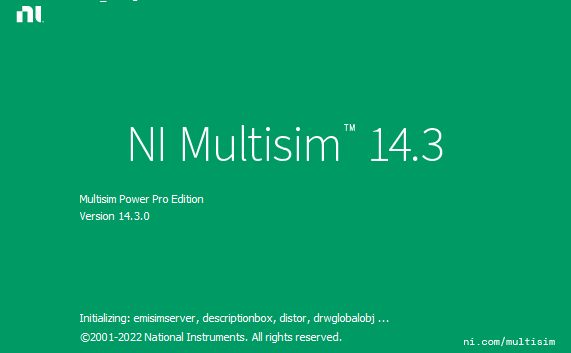

  
# Designing and Simulating of Digital Multiplexer

This project presents the design and simulation of a 4-to-1 digital multiplexer using only 2-to-1 inverting multiplexers constructed from NAND and NOT gates at the transistor level. A 2-to-1 MUX was first built using three NAND gates and one NOT gate, and then used as a module to create the complete 4-to-1 multiplexer. The project involved deriving the logic expressions, creating truth tables, implementing VHDL code, drawing transistor- level circuits, and verifying the functionality through simulations. Special care was taken to ensure correct selection line behavior and accurate transistor connections. The final design requires 42 transistors and successfully operates as intended, demonstrating a modular, efficient, and expandable approach to digital system design.

## DE-115 FPGA

For this project, we selected the DE1-115 FPGA development board from Intel (formerly Altera) as our main hardware platform. The DE1-115 board is built around the Cyclone IV EP4CE115 FPGA chip, offering a high number of logic elements, memory blocks, and multipliers, which made it highly suitable for complex digital system designs. In addition to the FPGA itself, the board includes a wide range of onboard peripherals such as SDRAM, Flash memory, Ethernet port, audio input/output, VGA output, USB ports, and an SD card slot, providing extensive options for developing and testing hardware and embedded systems. The presence of switches, push-buttons, LEDs, and seven-segment displays also made it easy to interact with and debug our designs during development.

Below is a photo of the DE1-115 FPGA board used in our project:

  

 

The DE1-115 board's rich feature set was crucial to the success of our work. It allowed us to implement, test, and verify our designs in real hardware, ensuring real-time performance and accurate behavior. The board’s SDRAM and Flash memory enabled us to store large datasets and configuration files, while the VGA output allowed us to display system outputs graphically when needed. Furthermore, the abundant general-purpose I/O pins provided flexibility to connect external sensors and devices if required. Overall, the DE1-115 board offered a powerful and versatile development environment that significantly contributed to the project's efficiency and reliability.

## Intel Quartus Prime

In order to develop, simulate, and program our designs onto the DE1-115 FPGA board, we used Intel Quartus Prime software. Quartus Prime is a comprehensive FPGA design environment that provides all the necessary tools for hardware description language (HDL) design, synthesis, simulation, timing analysis, and programming. It supports both VHDL and Verilog designs, offering powerful features like schematic entry, IP integration, and real-time compilation feedback. Using Quartus, we were able to write, compile, simulate, and debug our HDL code, and then configure the DE1-115 board directly through the programming tool. The software also allowed us to easily manage pin assignments and monitor resource usage, which helped optimize our design for the FPGA’s capabilities.

  

 

Using Intel Quartus Prime was critical to the success of our project. It provided a seamless workflow from writing HDL code to verifying the functionality through simulation, and finally downloading the configuration file onto the FPGA. Its built-in analysis and synthesis tools helped us quickly identify and correct errors, ensuring that our final design met timing and resource constraints. Additionally, the straightforward programming interface allowed us to configure the DE1-115 board efficiently, enabling rapid prototyping and testing throughout the development process.

## NI Multisim 14.3

As part of the project, we also used NI Multisim software to design and simulate circuits at the transistor level before implementing them on the FPGA. Multisim is a powerful electronic schematic capture and simulation environment widely used for designing, analyzing, and validating analog, digital, and mixed-signal circuits. It provides a comprehensive library of real-world components, including BJTs, MOSFETs, diodes, and passive elements, enabling us to build accurate transistor-level models of the circuits we planned to implement. Through Multisim’s simulation capabilities, we were able to verify the behavior of our designs, measure critical parameters, and optimize the circuits before moving to hardware implementation. This step was essential to ensure functionality and performance while minimizing errors during the FPGA programming phase.

  

 

Using Multisim significantly enhanced the reliability and efficiency of our project development process. It allowed us to perform detailed simulations, such as DC analysis, transient analysis, and AC sweep, which helped us thoroughly understand circuit behavior under various operating conditions. By catching design issues early through simulation, we reduced the risk of hardware failures and rework later on. Multisim’s intuitive interface and accurate simulation engine provided a solid foundation for the transistor-level design phase, ensuring that only fully tested and optimized designs were migrated to the FPGA implementation stage.

